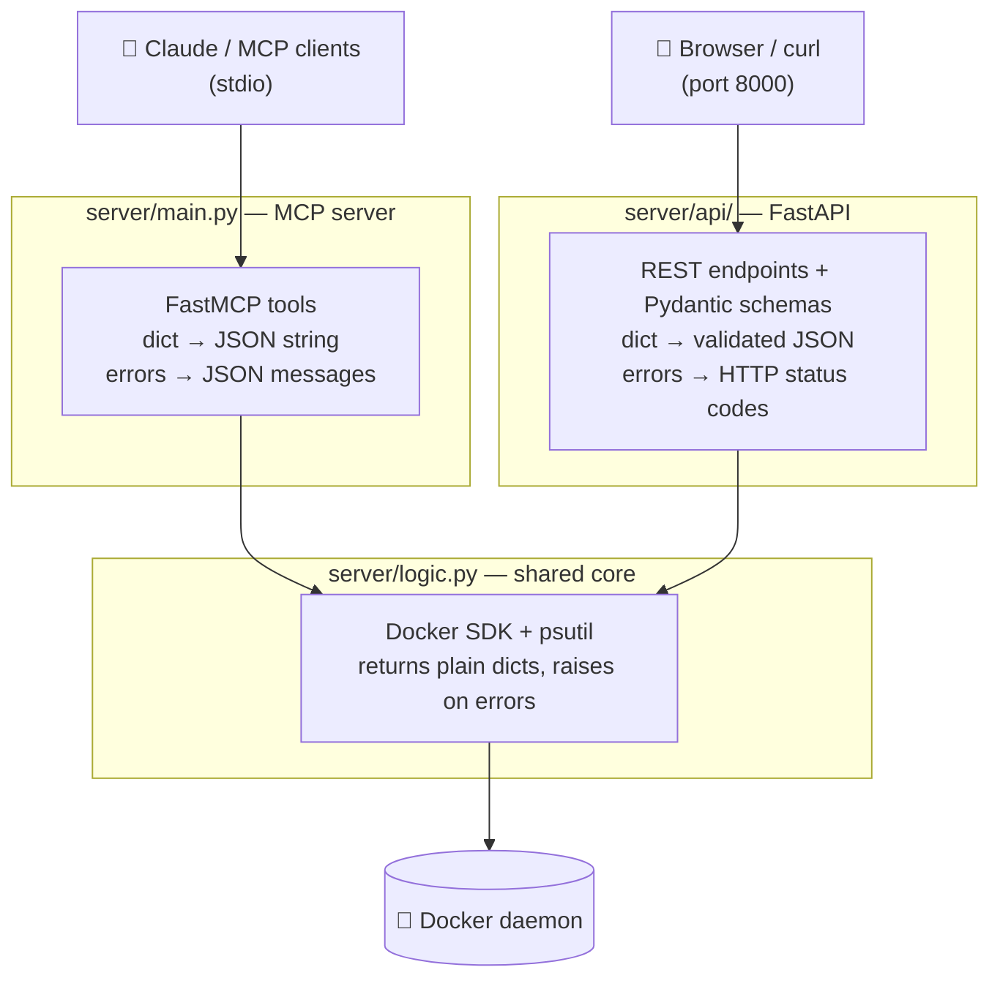

<div align="center">

# 🐳 MCP Docker Analyser

**Docker introspection for humans *and* AI.**

One shared core, two interfaces: an [MCP](https://modelcontextprotocol.io) server that lets AI assistants
(Claude Desktop, Claude Code, any MCP client) inspect your containers, and a FastAPI REST service for everyone else.

[](https://github.com/MateuszMusial/MCP-Docker_Analyser/actions/workflows/ci.yml)
[](https://www.python.org/)
[](https://modelcontextprotocol.io)
[](https://fastapi.tiangolo.com/)
[](https://docs.pydantic.dev/)
[](#-testing)
[](LICENSE)

</div>

---

## 💡 Why?

When a container misbehaves, the debugging loop is always the same: `docker ps`, `docker logs`, check
system resources, repeat. This project closes that loop for AI assistants — instead of pasting logs
into a chat, the assistant **pulls them itself**, reasons about the failure, and tells you what's wrong.

## 🎬 Demo — Claude diagnoses a crashed container

With the MCP server connected, ask Claude: *"Why did `broken_app` crash?"*

> **Claude** → calls `list_containers` … sees `demo_env-broken_app-1` is `exited`
> **Claude** → calls `get_container_logs("demo_env-broken_app-1", tail=15)`

```json
{
  "id": "17d7d66468b7",
  "name": "demo_env-broken_app-1",
  "status": "exited",
  "tail": 15,
  "logs": "[ERROR] DB connection failed (1/5): Connection refused (host=db, port=5432)\n[ERROR] DB connection failed (2/5): Connection refused (host=db, port=5432)\n...\n[ERROR] DB connection failed (5/5): Connection refused (host=db, port=5432)\n[CRITICAL] Too many failures — exiting\n"
}
```

> **Claude:** *"`broken_app` exhausted 5 retries connecting to `db:5432` and exited (code 1).
> There is no `db` service running — start the database or fix the hostname in its config."*

No copy-pasting logs. The assistant found the root cause itself.

## FastAPI web interface


## 🏗️ Architecture



The design rule: **logic returns data and raises; each frontend owns its presentation and error
translation.** Adding a new interface (CLI, TUI, gRPC…) never touches the core.

## 🧰 Features

| Capability | MCP tool | REST endpoint |
|---|---|---|
| List running containers | `list_containers` | `GET /containers` |
| Fetch last N log lines (running **or** exited) | `get_container_logs` | `GET /containers/{id}/logs?tail=100` |
| Host health — CPU / RAM / disk | `get_system_health` | `GET /system_health` |
| Landing page with live stats | — | `GET /` |
| Interactive API docs (OpenAPI) | — | `GET /docs`, `GET /redoc` |

Unknown container ids are handled per-interface: the MCP tool returns a readable JSON error for the
model; the API returns a proper `404`.

## 🚀 Quickstart

```bash
git clone https://github.com/MateuszMusial/MCP-Docker_Analyser.git
cd MCP-Docker_Analyser
python -m venv venv && source venv/bin/activate
pip install -r requirements.txt
```

> Requires a running Docker daemon and access to the Docker socket.

### 1 · Spin up the demo environment (optional, but fun)

```bash
cd demo_env && docker compose up --build -d && cd ..
```

This starts two containers built for testing the tooling:

- 🟢 **`healthy_app`** — runs forever, emitting realistic request logs
- 🔴 **`broken_app`** — fails to reach a non-existent database and dies with exit code 1

### 2 · Connect the MCP server to your AI assistant

**Claude Code** — drop this into `.mcp.json` at the project root:

```json
{
  "mcpServers": {
    "docker-analyser": {
      "command": "/absolute/path/to/venv/bin/python",
      "args": ["server/main.py"],
      "cwd": "/absolute/path/to/MCP-Docker_Analyser"
    }
  }
}
```

**Claude Desktop** — add the same entry under `mcpServers` in `claude_desktop_config.json`.

Then just ask: *“list my docker containers”*, *“why is broken_app failing?”*, *“is my machine running out of RAM?”*

### 3 · Or run the REST API

```bash
uvicorn server.api.main:app --reload
```

Open **http://127.0.0.1:8000** for the landing page, **/docs** for Swagger UI.

```bash
$ curl -s localhost:8000/containers | jq
[
  {
    "id": "9132102a2c74",
    "name": "wizardly_wing",
    "image": "healthy_app:latest",
    "status": "running"
  }
]

$ curl -s "localhost:8000/system_health" | jq
{
  "cpu_percent": 4.2,
  "memory": { "percent": 12.1, "total_mb": 15850, "available_mb": 13929 },
  "disk":   { "percent": 5.0,  "total_gb": 1006.9, "free_gb": 908.2 }
}

$ curl -s "localhost:8000/containers/nope/logs" | jq
{ "detail": "No container found matching 'nope'." }   # → HTTP 404
```

## 📁 Project structure

```
MCP-Docker_Analyser/
├── server/
│   ├── logic.py          # Shared core — Docker SDK + psutil, pure data in/out
│   ├── main.py           # MCP server (FastMCP, stdio transport)
│   └── api/
│       ├── main.py       # FastAPI app — REST endpoints
│       ├── schemas.py    # Pydantic response models
│       └── landing.html  # Self-contained landing page with live stats
├── demo_env/
│   ├── compose.yaml      # healthy_app + broken_app
│   ├── healthy_app/      # Long-running container (steady logs)
│   └── broken_app/       # Crashes on purpose (DB connection failures)
├── tests/
│   └── logic_test.py     # Unit tests — mocked Docker SDK & psutil
└── requirements.txt
```

## 🧪 Testing

```bash
python -m pytest --cov=server
```

- **100% line coverage on the core (`logic.py`)** — every field mapping, byte→MB/GB conversion,
  UTF-8 log decoding, and error path is asserted.
- Docker SDK and `psutil` are fully mocked (`pytest-mock`) — the suite runs without a Docker daemon.
- Static typing checked with **MyPy** (incl. `types-docker`, `types-psutil` stubs).

## 🗺️ Roadmap

- [ ] `inspect_docker_network` — let the AI see how containers are wired together ("why can't app reach db?")
- [ ] `all=True` option to also list stopped containers
- [ ] Dockerfile for the server itself (run the analyser as a container)
- [ ] SSE transport for remote MCP clients

## 📄 License

[MIT](LICENSE)
